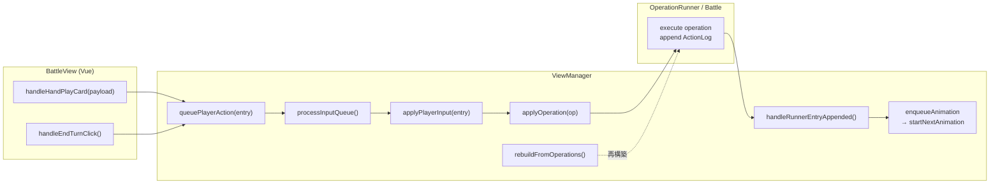

# ViewManager 設計メモ

## 役割
- `Battle` と `ActionLog` の橋渡し役として、UI 向けの最新スナップショットとアニメーション指示（`AnimationScript`）を生成する。
- プレイヤーからの入力（カード使用・ターン終了など）を順序付けて ActionLog へ書き込み、`Battle.executeActionLog` で盤面を前進させる。
- ActionLog のリプレイ・巻き戻しを担い、任意のインデックスから `Battle` を再構築する。

## 主なデータ構造
- **BattleViewState**  
  - `snapshot` / `previousSnapshot`: 最新盤面と比較用スナップショット。
  - `lastResolvedEntry`: 直近に解決した ActionLog エントリを UI へ渡す。
  - `playback`: アニメーションキュー、速度、ステータスを持つ。
  - `input`: プレイヤー入力のロック状態と保留キューを管理。
- **AnimationScript**  
  - `commands`: スナップショット更新やウェイト、カスタム演出を並べた配列。
  - `resolvedEntry`: 当該脚本が表現する ActionLog エントリの詳細。

## 入出力フロー
1. **初期化**  
   - `ViewManager.initialize()` が `ActionLogReplayer` を用いて指定インデックスまでログを適用し、`Battle` と初期スナップショットを構築。
2. **プレイヤー入力**  
   - `enqueuePlayerInput` で受け取り、順番に `handlePlayerInput` へ渡す。  
   - 入力は ActionLog エントリに変換され、`battle.executeActionLog` の再生結果で `snapshot` を更新。
3. **アニメーション通知**  
   - `normalizeAnimationScript`→`queue`へ積み、View 側から subscribe されたリスナーへ `animation-start` / `animation-complete` を発火。
4. **巻き戻し/リトライ**  
   - `reloadBattleAt` が ActionLog をそのまま利用し、新しい `Battle` を作り直して状態を同期。

## 注意点
- `Battle` 側で予期せぬ勝利／敗北状態になった場合も、`snapshot.status` が変われば UI は即時検知できる。そのため Victory 判定などはドメイン状態を優先して利用する。
- ActionLog は「プレイヤー操作の履歴」であり、敵の逃走など副次的なイベントはログに明示されない。UI は `snapshot` から派生情報を読み取る必要がある。

## 入力からアニメーション生成まで（Mermaid）

## rebuildFromOperations から handleRunnerEntryAppended までの流れ
- **起点: rebuildFromOperations**  
  - 初期化・巻き戻し・applyOperation 失敗時のやり直しで必ず呼ばれる。ここで `Battle` / `ActionLog` / `OperationRunner` を新規に作り直し、`onEntryAppended` に `handleRunnerEntryAppended` を登録する。
  - `suspendRunnerEvents` を一時的に `true` にし、再生用アニメーションを重複生成しないようにした上で、操作ログを 0 から指定インデックスまで順に `executeOperationWithRunner` で適用する。
- **OperationRunner 実行中**  
  - 各 `OperationLogEntry` が適用されるたびに `OperationRunner.appendEntry` が ActionLog に `BattleActionLogEntry` を追加し、登録済みの `onEntryAppended` を即時呼び出す。
- **handleRunnerEntryAppended の役割**  
  - `suspendRunnerEvents` が解除されている通常時のみ動作し、`resolveActionLogEntry` で UI 向けに解決したエントリを `stateValue.lastResolvedEntry` に反映する。
  - さらに `buildAnimationScriptFromEntry` でエントリ内容を `AnimationScript` に変換し、`enqueueAnimation` で再生キューへ積む。これが View (BattleView) に渡る唯一のアニメーション生成ポイントとなる。
- **結果の同期**  
  - `rebuildFromOperations` の最後で `playback` キューをリセットし、入力ロックを解除した上で `syncStateFromBattle` を呼ぶ。ここで最新スナップショットが `stateValue.snapshot` として確定し、以降の `handleRunnerEntryAppended` が生成するスクリプトと整合が取れる。
